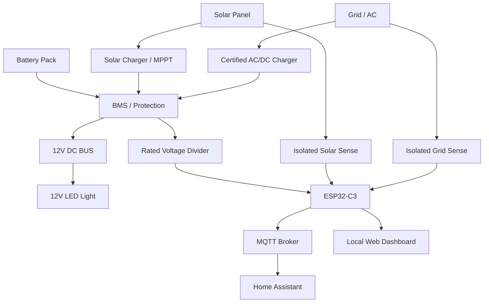
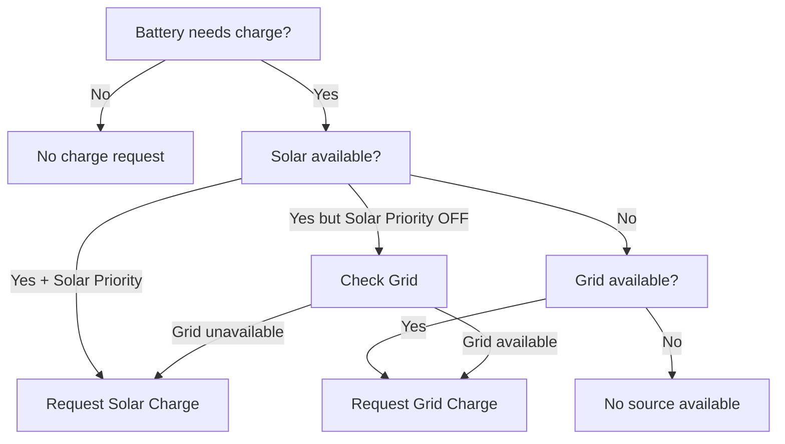
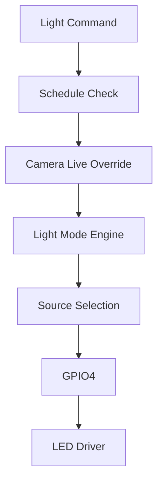
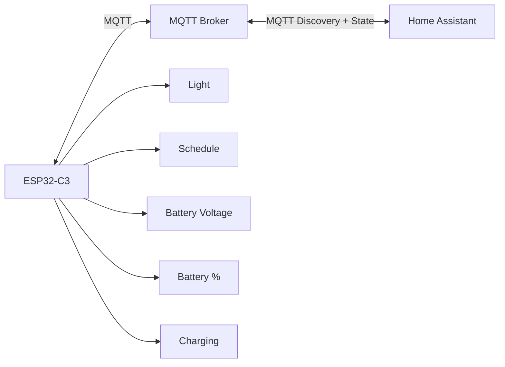
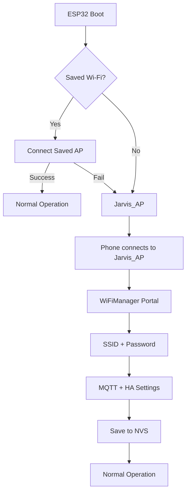
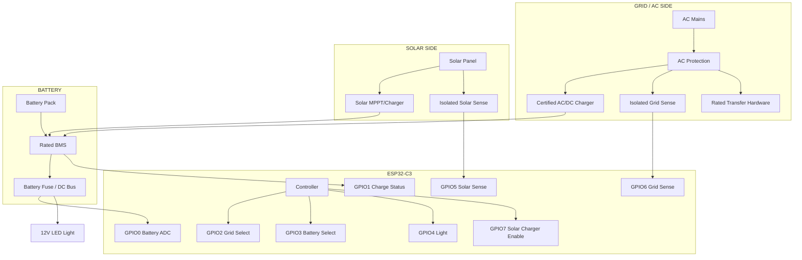

# JARVIS SMART LIGHT MONITORING SYSTEM

## ESP32-C3 • 12V Smart Light • Battery Backup • Solar/Grid Management • Home Assistant

> **Firmware:**
> `JARVIS_SMART_LIGHT_MONITORING_SYSTEM_ESP32_C3_V9_CLEAN_HA.ino`\
> **Documentation:** বাংলা\
> **Purpose:** বর্তমান কার্যকর firmware-এর hardware, wiring,
> configuration, Home Assistant, MQTT, commissioning এবং safety guide।

------------------------------------------------------------------------

## 1. সিস্টেমের পরিচয়

এটি ESP32-C3 ভিত্তিক 12V Smart Light Monitoring & Power Management
System। Firmware-এর দায়িত্ব:

-   12V LED light ON/OFF
-   SOLID / BLINK / PERIODIC mode
-   Schedule control
-   Camera-live override
-   Battery voltage ও chemistry-based approximate SOC
-   Solar/Grid availability detection
-   Solar-priority / Grid-fallback charging decision
-   Grid/Battery light-source selection
-   Optional charger-control output
-   MQTT + Home Assistant MQTT Discovery
-   Local authenticated dashboard
-   WiFiManager captive setup
-   OTA
-   Preferences/NVS
-   BOOT-button factory reset
-   Non-blocking main loop

**বর্তমান firmware কোনো নির্দিষ্ট BMS/charger/relay/MOSFET/PSU brand বা
vendor-specific BMS protocol hard-code করে না।**

------------------------------------------------------------------------

## 2. System Architecture



**AC/grid voltage কখনো সরাসরি ESP32 GPIO-তে দেওয়া যাবে না।** Grid
sensing ও source transfer অবশ্যই properly rated isolated hardware দিয়ে
করতে হবে।

------------------------------------------------------------------------

## 3. বর্তমান GPIO Map

     GPIO Firmware function             Direction   External interface
  ------- ----------------------------- ----------- ------------------------------
    GPIO0 Battery voltage ADC           Input       Rated resistor divider
    GPIO1 Charge status                 Input       Isolated/rated status signal
    GPIO2 Grid light source select      Output      Relay/MOSFET driver
    GPIO3 Battery light source select   Output      Relay/MOSFET driver
    GPIO4 Light output                  Output      LED MOSFET/relay driver
    GPIO5 Solar sense                   Input       Isolated/rated sense
    GPIO6 Grid sense                    Input       Isolated/rated sense
    GPIO7 Solar charger enable          Output      Charger enable/driver
    GPIO8 Status LED                    Output      On-board/status LED
    GPIO9 BOOT button                   Input       BOOT/factory reset

> Espressif-এর ESP32-C3-DevKitM-1 documentation অনুযায়ী GPIO2, GPIO8 এবং
> GPIO9 strapping pins। Exact board revision অবশ্যই physical board-এর
> সঙ্গে verify করতে হবে।\
> Official:
> https://docs.espressif.com/projects/esp-dev-kits/en/latest/esp32c3/esp32-c3-devkitm-1/user_guide.html

------------------------------------------------------------------------

## 4. Light Output Wiring

``` text
12V/BATTERY + -----------+------ LED LIGHT +
                         |
                         |
LED LIGHT - -------------+---- DRAIN
                              N-MOSFET
GPIO4 ---- Gate Resistor ----- GATE
                 |
             Gate Pulldown
                 |
GND ------------------------- SOURCE
ESP32 GND --------------------+
```

-   ESP32 GPIO4 দিয়ে LED সরাসরি চালানো যাবে না।
-   Logic-level N-MOSFET বা properly rated relay/driver ব্যবহার করতে হবে।
-   MOSFET, fuse, wire এবং heat-sink LED current অনুযায়ী নির্বাচন করতে
    হবে।

------------------------------------------------------------------------

## 5. Battery + BMS

``` text
Battery Cells
   |
   v
BMS / Protection
   |
   +---- PACK+
   +---- PACK-
          |
       12V DC BUS
        /       \
     LIGHT     CHARGER
```

Basic/passive BMS mode-এ ESP32-এর জন্য আলাদা BMS GPIO প্রয়োজন নেই। Smart
BMS communication future option হিসেবে রাখা যায়; vendor-specific
protocol firmware-এ hard-code করা নেই।

------------------------------------------------------------------------

## 6. Battery Voltage Divider

``` text
BATTERY +
    |
   R_TOP
    |
    +---------- GPIO0 / ADC
    |
 R_BOTTOM
    |
   GND
```

Firmware default divider ratio: **4.0303**। এটি final resistor value নয়।
Multimeter দিয়ে real pack voltage মেপে divider/calibration সেট করতে হবে।
ADC input ESP32-এর নিরাপদ range-এর মধ্যে রাখতে হবে।

Battery percentage voltage-based approximate SOC; এটি coulomb counter
নয়।

------------------------------------------------------------------------

## 7. Battery Chemistry

Firmware profiles:

  Profile     Firmware support
  ----------- ------------------
  Li-Ion      Yes
  LiFePO4     Yes
  Lead-Acid   Yes

Series count firmware limit: **1--16S**। কিন্তু বাস্তব safe series count
নির্ধারিত হবে battery, BMS, charger, divider, wiring এবং power
hardware-এর rating দ্বারা।

------------------------------------------------------------------------

## 8. Solar System

``` text
SOLAR PANEL
     |
     v
SOLAR CHARGER / MPPT
     |
     v
BATTERY / DC BUS
     |
     +----> LED SYSTEM

SOLAR AVAILABLE
     |
     v
ISOLATED / RATED SENSE
     |
     v
GPIO5
```

Firmware কোনো নির্দিষ্ট solar-controller protocol ধরে নেয় না। Solar
charger voltage/current অনুযায়ী নির্বাচন করতে হবে।

------------------------------------------------------------------------

## 9. Grid System

``` text
AC MAINS
   |
   +--> Certified AC/DC Charger ---> Battery/DC Bus
   |
   +--> Certified Isolated Sense --> GPIO6
```

**AC LIVE/NEUTRAL কখনো GPIO6 বা অন্য GPIO-তে direct connection নয়।**
Isolation, fuse, creepage/clearance, enclosure এবং local electrical
requirements মেনে hardware তৈরি করতে হবে।

------------------------------------------------------------------------

## 10. Grid/Battery Source Transfer

বর্তমান firmware:

``` text
GPIO2 = GRID_LIGHT_SELECT
GPIO3 = BATTERY_LIGHT_SELECT
```

Concept:

``` text
GRID SOURCE ---------\
                      >-- SOURCE SELECT --> LIGHT
BATTERY SOURCE ------/
                         ^
                         |
                     ESP32-C3
```

Firmware software-level break-before-make sequence ব্যবহার করে: current
source OFF → transfer delay → new source ON। **Hardware electrical
interlock অবশ্যই থাকতে হবে; software interlock একা যথেষ্ট নয়।**

------------------------------------------------------------------------

## 11. Charger Control

``` text
GPIO7
  |
  v
Driver / Relay / Charger Enable
  |
  v
Solar Charger Enable
```

বর্তমান firmware-এ `GRID_CHARGE_ENABLE_PIN = -1`; অর্থাৎ grid charger
enable-এর জন্য কোনো GPIO assigned নেই। এটি hardware-specific
implementation-এর জন্য intentionally open রাখা হয়েছে।

------------------------------------------------------------------------

## 12. Solar-Priority Charging Logic



------------------------------------------------------------------------

## 13. Light Control Logic

Modes:

``` text
OFF → SOLID → BLINK → PERIODIC
```



Camera-live override firmware-এ আছে, কিন্তু current clean Home Assistant
discovery-তে আলাদা control entity হিসেবে expose করা হয়নি।

------------------------------------------------------------------------

## 14. Schedule

Home Assistant-এ current clean controls:

1.  Schedule Enable
2.  Schedule Start
3.  Schedule End

Example:

``` text
Schedule = ON
Start    = 18:00
End      = 23:00
```

------------------------------------------------------------------------

## 15. Home Assistant Clean Entity Design

বর্তমান clean firmware-এ শুধু প্রয়োজনীয় entity discovery করা হয়।

### Control entities

  Entity            Type     কাজ
  ----------------- -------- -----------------------
  Light             Light    ON/OFF
  Schedule Enable   Switch   Schedule ON/OFF
  Schedule Start    Number   Start time in minutes
  Schedule End      Number   End time in minutes

### Read-only entities

  Entity               Type            কাজ
  -------------------- --------------- -----------------------
  Battery Percentage   Sensor          Approximate battery %
  Battery Voltage      Sensor          Pack voltage
  Charging             Binary Sensor   Charging status

### HA-তে expose করা হয় না

Animation Mode, Blink/Periodic controls, Battery
Series/Chemistry/threshold controls, Solar Priority, Source Transfer,
Charger Control, Camera Live, Solar/Grid sensors, Charging Source, Light
Source, Wi-Fi RSSI, Firmware/Uptime ইত্যাদি। এগুলো firmware/dashboard-এর
internal/configuration/status অংশে থাকতে পারে, কিন্তু clean HA
discovery-তে অপ্রয়োজনীয় entity হিসেবে রাখা হয়নি।

Home Assistant MQTT documentation:
https://www.home-assistant.io/integrations/mqtt/

------------------------------------------------------------------------

## 16. MQTT Architecture



Firmware `PubSubClient` ব্যবহার করে। MQTT broker হিসেবে Home Assistant
Mosquitto বা compatible broker ব্যবহার করা যায়।

------------------------------------------------------------------------

## 17. WiFiManager Setup



বর্তমান firmware WiFiManager-এর newly submitted Wi-Fi credentials এবং
নিজের `Config`/Preferences store synchronize করে।

------------------------------------------------------------------------

## 18. Local Dashboard

ESP32 local WebServer:

``` text
http://ESP32-IP/
```

Dashboard-এ light, mode/timing, schedule, battery/power configuration,
network/MQTT/HA, security এবং system controls রয়েছে। Dashboard
authenticated।

------------------------------------------------------------------------

## 19. OTA + Factory Reset

OTA:

``` text
Arduino IDE → Wi-Fi → ESP32-C3
```

BOOT button GPIO9 long-press factory reset-এর জন্য ব্যবহৃত হয়; current
firmware threshold **5 seconds**।

------------------------------------------------------------------------

## 20. Recommended Hardware BOM

> **এই তালিকার brand/model বর্তমান firmware থেকে প্রমাণিত installed
> hardware নয়।** এগুলো production design-এর জন্য example vendor/category।
> Exact model voltage/current/power/isolation rating দেখে নির্বাচন করতে
> হবে।

  --------------------------------------------------------------------------
  অংশ                     Category                   Example
                                                     manufacturer/vendor
  ----------------------- -------------------------- -----------------------
  MCU                     ESP32-C3                   Espressif

  Light MOSFET            Logic-level N-MOSFET       Infineon / Vishay /
                                                     STMicroelectronics

  Relay/contactor         Properly rated switching   Omron / Schneider
                                                     Electric / Finder

  Isolation               Optocoupler / certified    Vishay / Broadcom /
                          isolated interface         Toshiba

  12V PSU                 Certified DC supply        Mean Well

  Solar charger           Correctly rated MPPT/PWM   Victron Energy / EPEVER

  BMS                     Correct                    Daly / JBD
                          chemistry/series/current   
                          rating                     

  Fuse                    DC-rated fuse + holder     Littelfuse /
                                                     Eaton/Bussmann

  Terminal                Electrical-rated terminal  Phoenix Contact / WAGO

  Divider resistors       Precision resistors        Vishay / Yageo

  Enclosure               Electrical-rated enclosure Hammond / Fibox /
                                                     Schneider Electric

  MQTT                    MQTT broker                Mosquitto / Home
                                                     Assistant ecosystem
  --------------------------------------------------------------------------

**Vendor example মানেই final selection নয়।** Final choice: voltage,
current, power, temperature, isolation, fuse, wire gauge, connector এবং
enclosure অনুযায়ী।

------------------------------------------------------------------------

## 21. Manufacturer / Component Reference — ছবি সহ

> **গুরুত্বপূর্ণ:** নিচের ছবিগুলো production design-এর জন্য **representative reference illustration**। বর্তমান firmware বা source code থেকে কোনো নির্দিষ্ট installed brand/model প্রমাণিত নয়। Exact model নির্বাচন করার আগে voltage, current, power, temperature, isolation, fuse rating এবং enclosure rating verify করতে হবে।

### 21.1 Recommended manufacturer reference


**Reference manufacturer/category:**

- **Espressif** — ESP32-C3 controller
- **Infineon / Vishay / STMicroelectronics** — logic-level MOSFET category
- **Mean Well** — certified AC/DC PSU category
- **Victron Energy / EPEVER** — solar MPPT/charger category
- **Daly / JBD** — BMS category
- **Littelfuse / Eaton-Bussmann** — DC fuse/protection category
- **Phoenix Contact / WAGO** — terminal/connector category
- **Vishay / Yageo** — precision resistor category
- **Omron / Schneider Electric / Finder** — relay/contactor category
- **Broadcom / Toshiba** — isolation/isolated interface category
- **Hammond / Fibox / Schneider Electric** — enclosure category

### 21.2 Component category overview


### 21.3 Complete hardware connection overview


### 21.4 Exact hardware বনাম recommended hardware

| বিষয় | README-তে কী ধরা হয়েছে | Status |
|---|---|---|
| ESP32-C3 | ESP32-C3 based controller | **Source/design verified** |
| MOSFET | Logic-level N-MOSFET category | **Model NOT VERIFIED** |
| PSU | Certified AC/DC supply category | **Model NOT VERIFIED** |
| Solar charger | MPPT/PWM category | **Model NOT VERIFIED** |
| BMS | Passive/basic BMS compatible | **Brand/model NOT VERIFIED** |
| Fuse | Rated DC fuse + holder | **Model NOT VERIFIED** |
| Terminals | Rated industrial terminal/connector | **Model NOT VERIFIED** |
| Resistors | Precision divider/calibration network | **Exact values/load NOT VERIFIED** |
| Enclosure | Electrical-rated enclosure | **Model NOT VERIFIED** |

> তাই এই ছবিগুলোকে **“কোন কোম্পানির কোন category ব্যবহার করা যেতে পারে”** হিসেবে দেখো; এগুলোকে installed BOM বা exact purchasing list হিসেবে ধরা যাবে না।

---

## 22. Production Wiring Block Diagram



------------------------------------------------------------------------

## 23. Commissioning Procedure

### Step 1 --- Firmware

1.  Arduino IDE install.
2.  ESP32 Arduino core install.
3.  WiFiManager install.
4.  PubSubClient install.
5.  Actual ESP32-C3 board select.
6.  Compile.
7.  First USB upload.

### Step 2 --- No-load GPIO test

Verify GPIO4, GPIO2, GPIO3, GPIO7, GPIO5, GPIO6, GPIO0 এবং GPIO1
individually before connecting full-power hardware.

### Step 3 --- Wi-Fi

`Jarvis_AP` → WiFiManager → SSID/password → MQTT/HA settings → save.

### Step 4 --- MQTT

Broker host, port, username/password verify করো।

### Step 5 --- Home Assistant

MQTT integration active থাকলে Discovery device/entity তৈরি করবে।

### Step 6 --- Battery calibration

Multimeter pack voltage এবং firmware voltage মিলিয়ে ADC
divider/calibration adjust করো।

### Step 7 --- Light test

`OFF → SOLID → BLINK → PERIODIC → SCHEDULE → source transfer`।

### Step 8 --- Charging test

Solar/Grid detection প্রথমে low-risk test signal দিয়ে যাচাই করো; পরে
charger enable hardware test করো।

------------------------------------------------------------------------

## 24. Pre-Power Checklist

-   [ ] GPIO-তে 12V/AC direct connection নেই
-   [ ] Battery polarity correct
-   [ ] BMS correct series/current rating
-   [ ] Battery fuse installed
-   [ ] ADC divider verified
-   [ ] ADC input safe
-   [ ] Solar sense isolated/rated
-   [ ] Grid sense isolated/rated
-   [ ] Source-transfer interlock verified
-   [ ] Grid/Battery source simultaneous short হওয়ার সুযোগ নেই
-   [ ] MOSFET gate/driver verified
-   [ ] Relay coil voltage verified
-   [ ] GPIO2/8/9 boot behaviour verified
-   [ ] Charger voltage/current verified
-   [ ] Wire gauge verified
-   [ ] Enclosure/insulation verified

------------------------------------------------------------------------

## 25. Troubleshooting

### Wi-Fi connect হচ্ছে না

2.4 GHz network, SSID/password, router security এবং `Jarvis_AP`
configuration যাচাই করো। Serial Monitor-এ `[WIFI] connected` এবং IP
দেখো।

### Dashboard খুলছে না

Serial Monitor-এ `[DASHBOARD] http://...` address খুঁজে browser-এ সেই IP
open করো।

### Home Assistant entity নেই

ESP32 → Wi-Fi → MQTT broker → Home Assistant MQTT chain verify করো।

### Battery percentage ভুল

Chemistry, series, divider ratio, ADC calibration এবং multimeter reading
verify করো। Voltage-based SOC approximate।

### Source transfer কাজ করছে না

GPIO2/GPIO3, driver/relay, source sense এবং hardware interlock verify
করো।

------------------------------------------------------------------------

## 26. Software Architecture

``` text
PIN CONFIGURATION
      ↓
CONFIG / NVS
      ↓
GPIO
      ↓
BATTERY
      ↓
SOURCE DETECTION
      ↓
CHARGING ENGINE
      ↓
SOURCE TRANSFER
      ↓
LIGHT CONTROL
      ↓
MQTT
      ↓
HOME ASSISTANT DISCOVERY
      ↓
WiFiManager
      ↓
OTA
      ↓
WEB DASHBOARD
      ↓
SETUP / LOOP
```

বর্তমান architecture master example-এর pattern অনুসরণ করে রাখা হয়েছে;
Smart Light application layer-ই device-specific অংশ।

------------------------------------------------------------------------

## 27. Libraries / Software Components

  Component       কাজ
  --------------- ---------------------
  Arduino-ESP32   ESP32 platform
  WiFi            Wi-Fi
  WebServer       Local dashboard
  WiFiManager     Captive Wi-Fi setup
  PubSubClient    MQTT
  ArduinoOTA      OTA
  Preferences     NVS configuration
  time            Schedule/clock

Official references:

-   Espressif ESP32-C3-DevKitM-1:
    https://docs.espressif.com/projects/esp-dev-kits/en/latest/esp32c3/esp32-c3-devkitm-1/user_guide.html
-   Arduino ESP32: https://docs.espressif.com/projects/arduino-esp32/
-   Home Assistant MQTT:
    https://www.home-assistant.io/integrations/mqtt/
-   WiFiManager: https://github.com/tzapu/WiFiManager
-   PubSubClient: https://github.com/knolleary/pubsubclient

------------------------------------------------------------------------

## 28. `[NOT VERIFIED]` Hardware Items

Source code থেকে নিচের বিষয়গুলো নির্দিষ্ট করা যায় না; physical hardware
অনুযায়ী verify করতে হবে:

1.  Exact ESP32-C3 board revision
2.  Actual MOSFET part number
3.  Actual relay/contactor part number
4.  Actual battery/BMS brand/model
5.  Actual solar charger/MPPT
6.  Actual AC/DC supply
7.  Exact ADC divider resistor values
8.  Exact wire gauge
9.  Exact fuse ratings
10. Actual mains isolation implementation
11. Actual source-transfer interlock
12. Actual charger current limit

**Firmware hardware safety replace করে না।**

------------------------------------------------------------------------

## 29. Final System

``` text
                  ┌─────────────────────┐
                  │    HOME ASSISTANT   │
                  │                     │
                  │ Light ON/OFF        │
                  │ Schedule            │
                  │ Battery %           │
                  │ Battery Voltage     │
                  │ Charging            │
                  └─────────┬───────────┘
                            │ MQTT
                  ┌─────────▼───────────┐
                  │     MQTT BROKER     │
                  └─────────┬───────────┘
                            │
                  ┌─────────▼───────────┐
                  │      ESP32-C3       │
                  │  JARVIS CONTROLLER  │
                  └────┬────┬────┬──────┘
                       │    │    │
                    LIGHT BATTERY POWER
                       │    │    │
                       ▼    ▼    ▼
                      LED  BMS SOLAR/GRID
```

**এই README বর্তমান V9 Clean HA firmware-এর documentation। Hardware
brand/model যোগ করার আগে electrical rating, isolation এবং interlock
verify করা বাধ্যতামূলক।**
