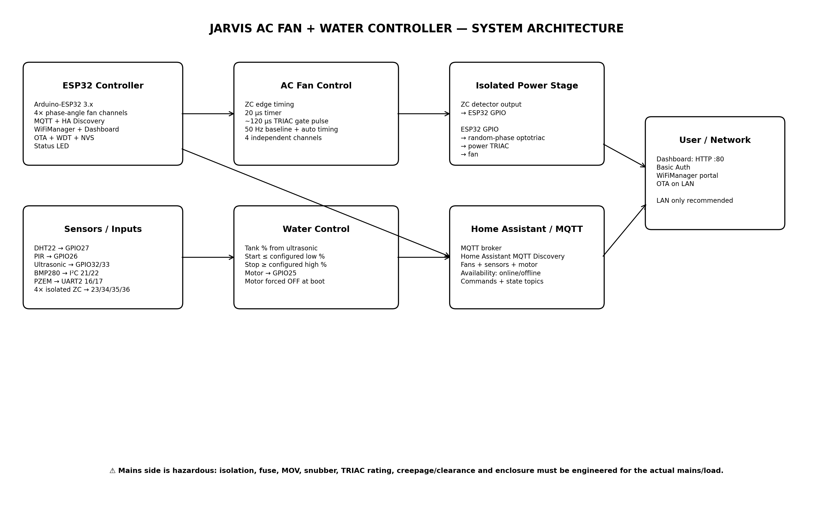

# JARVIS AC FAN + WATER CONTROLLER
## বাংলা সম্পূর্ণ README / ইনস্টলেশন / আর্কিটেকচার / পিন-ম্যাপ / অপারেশন ম্যানুয়াল

> **ডকুমেন্টের ভিত্তি:** বর্তমান JARVIS firmware-এর source এবং সর্বশেষ Status-LED firmware revision।  
> **গুরুত্বপূর্ণ:** এই README-তে hardware/component সম্পর্কে যা source-এ নির্দিষ্ট করা নেই, তা ইচ্ছাকৃতভাবে “নির্দিষ্ট নয় / যাচাই করতে হবে” হিসেবে রাখা হয়েছে।

---

## 1. প্রজেক্টটি কী?

এটি ESP32 ভিত্তিক একটি **AC Fan + Water Controller**। একই ESP32 থেকে:

- ৪টি AC fan-এর ON/OFF control
- ৪টি fan-এর 0–100% speed command
- Zero-Cross synchronized **phase-angle TRIAC** speed control
- DHT22 temperature/humidity
- BMP280 pressure
- PIR motion
- Ultrasonic water-level measurement
- PZEM electrical measurements
- Automatic water motor control
- MQTT
- Home Assistant MQTT Discovery
- WiFiManager configuration portal
- Browser dashboard
- Dashboard HTTP Basic Authentication
- OTA update
- Preferences/NVS configuration storage
- Watchdog
- WiFi + MQTT status LED

চলে।

---

# 2. সম্পূর্ণ Architecture



### Data/control flow

```text
                  ┌─────────────────────────┐
                  │        ESP32             │
                  │ Arduino-ESP32 3.x       │
                  └───────────┬─────────────┘
                              │
        ┌─────────────────────┼─────────────────────┐
        │                     │                     │
        ▼                     ▼                     ▼
   Sensors/Input        AC Fan Control        Water Motor
 DHT22 / BMP280 /      ZC → phase angle       Ultrasonic →
 PIR / PZEM /          → random-phase         percentage →
 Ultrasonic            optotriac → TRIAC      GPIO25
        │                     │
        └──────────────┬──────┘
                       ▼
                 MQTT Broker
                       │
                       ▼
               Home Assistant
                       │
             MQTT Discovery
                       │
                       ▼
                 HA Entities

Browser ──HTTP :80──> ESP32 Dashboard
WiFiManager ────────> ESP32 configuration
OTA ────────────────> ESP32 firmware update
```

---

# 3. মূল Hardware / Technology

## 3.1 Main controller

| অংশ | বর্তমান design |
|---|---|
| MCU | ESP32 |
| Framework | Arduino-ESP32 3.x |
| Fan control | AC phase-angle TRIAC |
| Synchronization | Isolated zero-cross detector |
| Network | WiFi |
| Messaging | MQTT |
| HA integration | MQTT Discovery |
| Web server | ESP32 `WebServer` |
| Config | WiFiManager + Preferences/NVS |
| Update | ArduinoOTA |
| Safety monitoring | Watchdog |

### Manufacturer / company সম্পর্কে

- **ESP32** → Espressif-এর ESP32 family।
- **Arduino-ESP32** → Espressif hardware-এর জন্য Arduino core।
- **Adafruit_BMP280** library ব্যবহার করা হয়েছে BMP280-এর জন্য।
- **PZEM004Tv30** library ব্যবহার করা হয়েছে PZEM-এর জন্য।
- **DHT** library ব্যবহার করা হয়েছে DHT22-এর জন্য।
- **WiFiManager**, **PubSubClient** এবং **ArduinoOTA** software libraries।
- **DHT22, PZEM, PIR, ultrasonic module, power TRIAC এবং zero-cross circuit-এর exact manufacturer/source বর্তমান firmware-এ নির্দিষ্ট করা নেই।** তাই exact brand ধরে নেওয়া যাবে না।

---

# 4. GPIO / Pin Map — কোন GPIO কোথায়

## 4.1 Fan TRIAC outputs

| Fan | ESP32 GPIO | কাজ |
|---|---:|---|
| Fan 1 TRIAC | GPIO13 | TRIAC gate driver output |
| Fan 2 TRIAC | GPIO14 | TRIAC gate driver output |
| Fan 3 TRIAC | GPIO18 | TRIAC gate driver output |
| Fan 4 TRIAC | GPIO19 | TRIAC gate driver output |

**এগুলো সরাসরি mains-এ যাবে না।** ESP32 output → appropriate resistor/driver arrangement → **random-phase optotriac** → power TRIAC gate architecture অনুযায়ী হবে।

---

## 4.2 Zero-Cross inputs

| Fan | GPIO | Firmware profile |
|---|---:|---|
| Fan 1 ZC | GPIO23 | AC-OPTO/RISING default |
| Fan 2 ZC | GPIO34 | AC-OPTO/RISING default |
| Fan 3 ZC | GPIO35 | AC-OPTO/RISING default |
| Fan 4 ZC | GPIO36 | AC-OPTO/RISING default |

### বিশেষ সতর্কতা

GPIO34, GPIO35 এবং GPIO36 **input-only**। এগুলোতে internal pull-up ধরে নেওয়া যাবে না। Zero-cross detector output-এর জন্য প্রয়োজনীয় external bias/pull-up hardware-এ দিতে হবে।

---

## 4.3 Sensors / motor

| Device | GPIO / interface |
|---|---|
| DHT22 data | GPIO27 |
| PIR | GPIO26 |
| Ultrasonic TRIG | GPIO32 |
| Ultrasonic ECHO | GPIO33 |
| Water motor control | GPIO25 |
| I²C SDA | GPIO21 |
| I²C SCL | GPIO22 |
| PZEM RX | GPIO16 |
| PZEM TX | GPIO17 |
| Status LED | GPIO2 default |

> Status LED-এর জন্য বর্তমান firmware-এ `STATUS_LED_PIN 2` রাখা হয়েছে। আপনার ESP32 board-এ onboard LED অন্য GPIO-তে হলে **শুধু এই definition পরিবর্তন করতে হবে**।

---

# 5. AC Fan Speed Control কীভাবে কাজ করে?

এটি **PWM fan control নয়**।

এটি:

```text
AC mains
   │
   ▼
Zero-Cross Detector
   │ isolated low-voltage output
   ▼
ESP32 ZC GPIO
   │
   ▼
Zero-cross ISR
   │
   ▼
Calculated phase delay
   │
   ▼
TRIAC gate pulse
   │
   ▼
Random-phase optotriac
   │
   ▼
Power TRIAC
   │
   ▼
AC Fan
```

Firmware mains half-cycle মাপতে পারে এবং default 50 Hz baseline ব্যবহার করে।

- Timer tick: **20 µs**
- TRIAC gate pulse: **~120 µs**
- Early margin: **250 µs**
- Late margin: **500 µs**
- Auto mains timing: enabled

---

# 6. কোন Optotriac ব্যবহার করা যাবে?

## Phase-angle speed control-এর জন্য

Firmware documentation-এ random-phase driver class হিসেবে উল্লেখ আছে:

- MOC3020
- MOC3021
- MOC3022
- MOC3023
- MOC3051
- MOC3052
- Vishay VOT8121 family / equivalent random-phase phototriac driver

### 120/127 VAC

MOC302x family appropriate হতে পারে **তার নিজস্ব ratings এবং power-stage design-এর মধ্যে**।

### 220/230/240 VAC

Driver + power TRIAC-এর voltage rating এবং surge margin অবশ্যই actual mains অনুযায়ী নির্বাচন করতে হবে। Firmware source-এ MOC3051/MOC3052 বা equivalent 600/800 V random-phase driver safer listed choice হিসেবে উল্লেখ করা হয়েছে।

---

# 7. কোন Optotriac ব্যবহার করা যাবে না?

### ❌ MOC306x দিয়ে এই phase-angle speed control করবেন না

বিশেষ করে:

- MOC3062
- MOC3063
- একই ধরনের zero-cross phototriac driver

কারণ এগুলো zero-cross switching-এর জন্য; arbitrary phase-angle firing-এর জন্য নয়।

---

# 8. Zero-Cross detector কী ব্যবহার করা যাবে?

Firmware profile আছে:

1. AC-OPTO / RISING
2. AC-OPTO / FALLING
3. MODULE / RISING
4. MODULE / FALLING
5. PC817 AC DETECTOR / RISING
6. PC817 AC DETECTOR / FALLING

Source-এ AC-input optocoupler class হিসেবে উদাহরণ:

- H11AA1
- IL250
- IL252
- LTV-814/LTV-824/LTV-844 AC-input versions

PC817-এর ক্ষেত্রে:

> **PC817 নিজে সরাসরি AC mains-এ লাগানো যাবে না।**

Proper rectifier/front-end এবং current-limiting network দরকার।

### Commercial zero-cross module

শুধু তখনই ব্যবহারযোগ্য যখন module-এর output:

- electrically isolated,
- ESP32-safe voltage level,
- এবং selected rising/falling profile-এর সাথে compatible।

---

# 9. কোন hardware ব্যবহার করা যাবে না?

নিচের জিনিসগুলো source-এর architecture অনুযায়ী সরাসরি ব্যবহার করা যাবে না:

### ❌ Phase-angle-এর জায়গায় zero-cross optotriac
MOC306x/VOT8024 class।

### ❌ PC817-কে raw AC mains-এ সরাসরি
PC817-এর জন্য proper AC detector front-end দরকার।

### ❌ ESP32 GPIO-তে mains
কখনোই নয়।

### ❌ Non-isolated zero-cross output
ESP32-এর সাথে সরাসরি mains-derived non-isolated signal architecture ব্যবহার করা যাবে না।

### ❌ GPIO34–36-এ internal pull-up-এর উপর নির্ভর
এই pins input-only; external bias দরকার।

### ❌ Power TRIAC/fuse/snubber/MOV না জেনে random component
Mains stage actual voltage/current অনুযায়ী engineer করতে হবে।

---

# 10. Mains safety

এটি সবচেয়ে গুরুত্বপূর্ণ অংশ।

```text
          MAINS SIDE
  ┌─────────────────────────────┐
  │ Fuse                        │
  │ MOV                         │
  │ Power TRIAC                 │
  │ RC snubber                  │
  │ Fan load                    │
  │ Proper creepage/clearance   │
  └──────────────┬──────────────┘
                 │
        GALVANIC ISOLATION
                 │
  ┌──────────────▼──────────────┐
  │ LOW VOLTAGE ESP32 SIDE      │
  │ GPIO / logic / MQTT / WiFi  │
  └─────────────────────────────┘
```

Mains-side fuse, MOV, snubber, TRIAC rating, heatsink, creepage/clearance, PCB layout এবং enclosure **actual mains voltage এবং fan current অনুযায়ী qualified electrical designer দ্বারা যাচাই করতে হবে।**

---

# 11. Sensors

## DHT22

- GPIO27
- Temperature
- Humidity

## BMP280

I²C:

- SDA → GPIO21
- SCL → GPIO22
- Address → firmware-এ `0x76`

## PIR

- GPIO26

## Ultrasonic

- TRIG → GPIO32
- ECHO → GPIO33

Firmware distance থেকে water percentage হিসাব করে।

Default:

- Tank empty distance = 110 cm
- Tank full distance = 10 cm

Dashboard থেকে পরিবর্তনযোগ্য।

## PZEM

UART2:

- RX → GPIO16
- TX → GPIO17

Firmware voltage/current/power publish করে।

---

# 12. Water motor logic

Motor output:

**GPIO25**

Default water logic:

- Water percentage ≤ `motor_start_pct` → motor ON
- Water percentage ≥ `motor_stop_pct` → motor OFF

Default:

- Start = 15%
- Stop = 98%

### Boot safety

Reboot-এর পর motor-এর saved state blindly restore করা হয় না।

Motor boot-এ:

```text
OFF
```

থাকে।

তারপর normal water-level logic motor চালানোর অনুমতি দেয়।

---

# 13. MQTT

Default broker:

```text
homeassistant.local
```

Default port:

```text
1883
```

Default MQTT username:

```text
esp32
```

Default MQTT password:

```text
12345678
```

> **Production deployment-এর আগে MQTT password অবশ্যই পরিবর্তন করুন।**

---

# 14. MQTT Topics

## Availability

```text
jarvis/status/availability
```

Values:

```text
online
offline
```

## Fan command

Fan 1:

```text
jarvis/sf1/cmd
jarvis/sf1/speed/cmd
```

Fan 2:

```text
jarvis/sf2/cmd
jarvis/sf2/speed/cmd
```

Fan 3:

```text
jarvis/sf3/cmd
jarvis/sf3/speed/cmd
```

Fan 4:

```text
jarvis/sf4/cmd
jarvis/sf4/speed/cmd
```

ON/OFF state:

```text
jarvis/status/sf1
jarvis/status/sf2
jarvis/status/sf3
jarvis/status/sf4
```

Speed state:

```text
jarvis/status/sf1/speed
...
```

Zero-cross status:

```text
jarvis/status/sf1/zc
...
```

Motor:

```text
jarvis/motor/cmd
jarvis/status/motor
```

Sensors:

```text
jarvis/sensor/water_pct
jarvis/sensor/temp
jarvis/sensor/hum
jarvis/sensor/volt
jarvis/sensor/curr
jarvis/sensor/pwr
jarvis/sensor/pir
jarvis/sensor/pressure
```

---

# 15. Home Assistant integration

Firmware **MQTT Discovery** ব্যবহার করে।

Home Assistant MQTT broker-এ connected হওয়ার পর firmware নিজে discovery configuration publish করে।

এর ফলে:

- 4 Fan entity
- Temperature
- Humidity
- Water level
- Voltage
- Current
- Power
- Pressure
- PIR
- Water motor
- 4 Zero-cross status

ইত্যাদি Home Assistant-এ তৈরি হতে পারে।

### Device information

Firmware discovery-তে:

```text
Manufacturer: Jarvis
Model: AC Fan & Water Controller
```

এবং configured device name/ID ব্যবহার করা হয়।

---

# 16. WiFi configuration

WiFiManager ব্যবহার করা হয়েছে।

যখন ESP32-তে valid WiFi connection/configuration পাওয়া যায় না, WiFiManager configuration portal চালু করতে পারে।

AP name:

```text
Jarvis_AP
```

Portal-এ MQTT এবং Home Assistant-এর configuration parameters-ও আছে।

Configuration NVS-এ save হয়।

---

# 17. Dashboard কীভাবে খুলবেন?

ESP32 এবং ফোন/PC **একই LAN/WiFi network**-এ থাকলে ESP32-এর IP address বের করুন।

তারপর browser-এ:

```text
http://ESP32_IP/
```

উদাহরণ:

```text
http://192.168.1.50/
```

> Exact IP আপনার router/DHCP-এর উপর নির্ভর করে; firmware fixed IP ধরে নিচ্ছে না।

---

# 18. Dashboard login

বর্তমান firmware-এ Dashboard আলাদা admin authentication ব্যবহার করে।

Default:

```text
Username: admin
Password: admin12345
```

এটি MQTT password থেকে আলাদা।

### Browser কী করবে?

Dashboard খুললে browser HTTP Basic Authentication চাইবে।

সেখানে:

```text
admin
admin12345
```

দিতে হবে।

---

# 19. Admin password পরিবর্তন

Authenticated dashboard-এ **Dashboard Admin Security** section থেকে username/password পরিবর্তন করা যায়।

নতুন password-এর minimum length:

```text
8 characters
```

Password NVS-এ সংরক্ষিত হয়।

---

# 20. Password ভুলে গেলে / Reset

### গুরুত্বপূর্ণ

Firmware-এ সাধারণ “Reset button চাপলেই admin password factory default” ধরনের আলাদা documented physical reset procedure নেই।

তাই password ভুলে গেলে:

1. ESP32-এর serial/firmware access ব্যবহার করে recovery করতে হবে, অথবা
2. NVS/configuration erase করে factory configuration পুনরায় নিতে হবে।

### NVS erase করলে কী হারাতে পারে?

NVS-এ শুধু admin password নয়, আরও configuration থাকে:

- MQTT host
- MQTT port
- MQTT username/password
- HA host/port/name/ID
- fan limits
- startup speed
- water thresholds
- ZC profiles
- ZC timing offsets
- saved fan speeds
- motor state data

তাই **NVS erase = শুধু password reset নয়; configuration reset হিসেবেও বিবেচনা করতে হবে।**

> ভবিষ্যতে আলাদা physical “Factory Reset” button যোগ করতে হলে সেটি এই README-র বর্তমান firmware-এর অংশ হিসেবে ধরে নেওয়া যাবে না।

---

# 21. Status LED

বর্তমান firmware-এ:

```text
STATUS_LED_PIN = GPIO2
```

LED logic:

### Reset / Boot

```text
BLINK
```

### WiFi disconnected

```text
BLINK
```

### WiFi connected কিন্তু MQTT disconnected

```text
BLINK
```

### WiFi + MQTT দুটোই connected

```text
SOLID ON
```

### যেকোনো connection আবার drop করলে

```text
BLINK
```

Blink interval:

```text
500 ms
```

---

# 22. OTA

OTA hostname:

```text
jarvis-fan-system
```

OTA password বর্তমান firmware-এ configured MQTT password থেকে নেওয়া হয়।

অর্থাৎ MQTT password পরিবর্তন করলে নতুন OTA password **পরবর্তী reboot-এর পরে** কার্যকর হয়।

---

# 23. Preferences / NVS

Namespace:

```text
jarvis_sys
```

এখানে configuration/state-এর গুরুত্বপূর্ণ অংশ সংরক্ষণ করা হয়।

উদাহরণ:

```text
mqtt_host
mqtt_port
mqtt_user
mqtt_pass

adm_user
adm_pass

ha_host
ha_port
ha_name
ha_id

f_min
f_max
f_start

t_e
t_f
m_s
m_p

zc0 ... zc3
zco0 ... zco3

sf1_sp ... sf4_sp
m_st
```

---

# 24. Fan speed persistence

Fan-এর শেষ speed NVS-এ save হয়।

Reboot-এর পরে saved fan speed restore হতে পারে।

Motor-এর ক্ষেত্রে আলাদা safety behavior:

```text
Motor boot = OFF
```

তারপর water-level automation motor চালাতে পারে।

---

# 25. Zero-Cross profile পরিবর্তন

Dashboard-এর Configuration section-এ প্রতি fan-এর জন্য profile নির্বাচন করা যায়।

Available:

```text
AC-OPTO / RISING
AC-OPTO / FALLING

MODULE / RISING
MODULE / FALLING

PC817 AC DETECTOR / RISING
PC817 AC DETECTOR / FALLING
```

Timing offset:

```text
-2000 µs ... +2000 µs
```

NVS-এ save হয়।

Firmware rebuild ছাড়াই profile পরিবর্তন করা যায়।

---

# 26. Recommended commissioning sequence

## ধাপ ১ — Mains connect করার আগে

শুধু ESP32 + low-voltage electronics test করুন।

Check:

- GPIO map
- DHT22
- BMP280
- PIR
- ultrasonic
- PZEM
- WiFi
- MQTT
- dashboard
- status LED

## ধাপ ২ — Zero-cross test

প্রতিটি ZC input আলাদাভাবে verify করুন।

Dashboard-এ:

```text
ZC = OK
```

আসা উচিত।

## ধাপ ৩ — TRIAC stage

Fan connected করার আগে gate driver এবং power-stage qualified hardware test করুন।

## ধাপ ৪ — One fan

প্রথমে একটি fan দিয়ে:

```text
OFF
20%
40%
60%
80%
100%
```

test করুন।

## ধাপ ৫ — সব fan

তারপর Fan 1–4 একসাথে test করুন।

## ধাপ ৬ — Water system

Ultrasonic distance এবং percentage verify করুন।

তারপর motor start/stop thresholds test করুন।

---

# 27. Troubleshooting

## LED সবসময় blink

সম্ভাব্য:

- WiFi connected নয়
- MQTT connected নয়
- MQTT broker unreachable
- MQTT credentials ভুল

## WiFi আছে, MQTT নেই

Check:

```text
MQTT Host
MQTT Port
MQTT Username
MQTT Password
Broker running?
```

## Fan ON কিন্তু speed control কাজ করছে না

Check:

- Zero-cross detector
- ZC GPIO
- ZC profile
- external pull-up/bias
- random-phase optotriac
- power TRIAC stage
- fan compatibility
- ZC dashboard status

## ZC FAULT

Check:

- correct GPIO
- detector output
- external pull-up
- correct rising/falling profile
- isolation
- mains-side detector circuit

## Motor ভুল সময় ON/OFF

Check:

```text
Tank Empty Distance
Tank Full Distance
Motor Start Water %
Motor Stop Water %
```

## Dashboard খুলছে না

Check:

1. ESP32 IP
2. Same LAN
3. `http://IP/`
4. browser authentication
5. admin username/password

---

# 28. Security notes

### Dashboard

বর্তমান dashboard HTTP Basic Authentication ব্যবহার করে।

কিন্তু এটি:

```text
HTTP
```

— HTTPS নয়।

তাই password public Internet-এ expose করা যাবে না।

### Recommended

ESP32 dashboard:

```text
Trusted LAN / VLAN
```

এর মধ্যে রাখুন।

Router port-forward করে সরাসরি Internet-এ expose করবেন না।

### MQTT

Default password:

```text
12345678
```

production-এর জন্য যথেষ্ট শক্তিশালী নয়।

প্রথম commissioning-এর পর পরিবর্তন করুন।

---

# 29. কোন অংশ firmware, কোন অংশ hardware

## Firmware

- Fan control algorithm
- Zero-cross timing
- MQTT
- HA Discovery
- Dashboard
- WiFiManager
- OTA
- WDT
- NVS
- Sensor polling
- Water percentage logic
- Motor logic
- Status LED

## Hardware

- ESP32
- DHT22
- BMP280
- PIR
- Ultrasonic sensor
- PZEM
- Zero-cross detector
- Optotriac
- Power TRIAC
- Fuse
- MOV
- Snubber
- Heatsink
- Motor switching stage
- Proper isolated power supply

---

# 30. Production checklist

- [ ] ESP32 GPIO map verified
- [ ] GPIO34/35/36 external bias verified
- [ ] Zero-cross isolation verified
- [ ] Correct ZC profile selected
- [ ] Random-phase optotriac selected
- [ ] MOC306x avoided for phase-angle control
- [ ] Power TRIAC voltage/current rating verified
- [ ] Fuse installed
- [ ] MOV selected for actual mains
- [ ] Snubber verified
- [ ] Creepage/clearance verified
- [ ] Enclosure verified
- [ ] MQTT password changed
- [ ] Dashboard admin password changed
- [ ] Dashboard not Internet exposed
- [ ] One-fan test completed
- [ ] Four-fan test completed
- [ ] Motor safety test completed
- [ ] WiFi loss test completed
- [ ] MQTT loss test completed
- [ ] Reboot test completed
- [ ] OTA test completed

---

# 31. বর্তমান design-এর গুরুত্বপূর্ণ সীমা

এই README বা firmware কোনো নির্দিষ্ট mains voltage/current-এর জন্য certified electrical design নয়।

বিশেষ করে power TRIAC, fuse, MOV, snubber, resistor network, optocoupler LED current, heatsink, PCB creepage/clearance এবং enclosure **actual hardware এবং mains-এর ভিত্তিতে আলাদাভাবে engineering/verification করতে হবে।**

Exact component manufacturer যেখানে firmware-এ নির্দিষ্ট নেই, সেখানে এই README কোনো brand অনুমান করছে না।

---

# 32. সংক্ষিপ্ত Reference Card

```text
PROJECT
JARVIS AC FAN + WATER CONTROLLER

MCU
ESP32

FAN TRIAC
13 / 14 / 18 / 19

FAN ZC
23 / 34 / 35 / 36

DHT22
27

PIR
26

ULTRASONIC
TRIG 32
ECHO 33

MOTOR
25

I2C
SDA 21
SCL 22

PZEM
RX 16
TX 17

STATUS LED
GPIO2

DASHBOARD
http://ESP32_IP/

DEFAULT ADMIN
admin / admin12345

DEFAULT MQTT
esp32 / 12345678

MQTT AVAILABILITY
jarvis/status/availability

WIFI CONFIG AP
Jarvis_AP

OTA HOST
jarvis-fan-system
```

---

## শেষ কথা

এই firmware-এর মূল architecture হলো:

**ESP32 → isolated Zero-Cross → phase-angle TRIAC → 4 fan**

এবং একই ESP32:

**Sensors → MQTT → Home Assistant**

এবং:

**Browser → authenticated Dashboard → ESP32**

এই তিনটি layer একসাথে কাজ করে।

**Mains side-এ কাজ করার আগে power-stage isolation এবং electrical safety verification বাধ্যতামূলক।**
