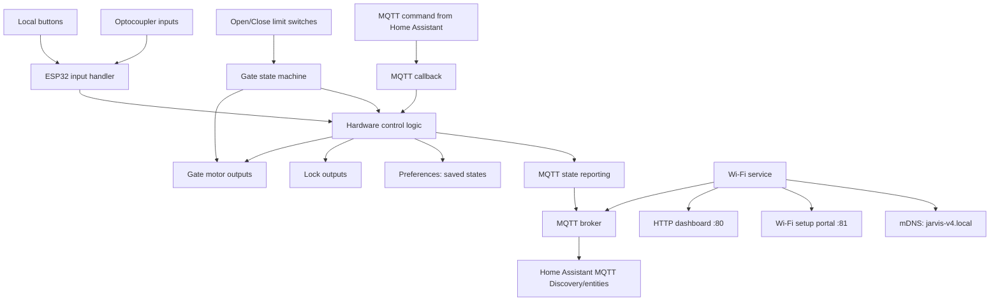
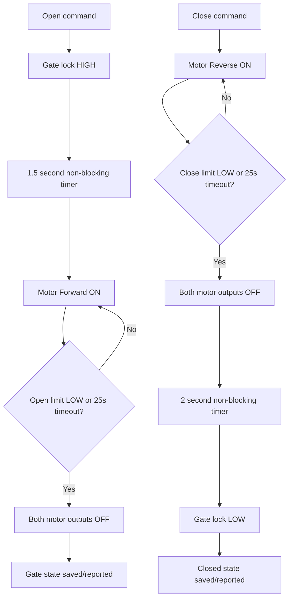

# JARVIS V4 FINAL — সম্পূর্ণ প্রজেক্ট ব্লুপ্রিন্ট

> **ডকুমেন্টের উদ্দেশ্য:** `JARVIS_V4_FINAL_NonBlocking.ino` ফার্মওয়্যারের হার্ডওয়্যার পিন, কন্ট্রোল লজিক, Wi‑Fi/MQTT কনফিগারেশন, Home Assistant discovery, ওয়েব ড্যাশবোর্ড, স্টোরেজ, ডায়াগ্রাম, সেটআপ ও টেস্ট পরিকল্পনা এক জায়গায় রাখা।
>
> **গুরুত্বপূর্ণ:** এটি সোর্স কোডের ভিত্তিতে তৈরি ডকুমেন্ট। বোর্ডে ফ্ল্যাশ করে বাস্তবে পরীক্ষা না করা পর্যন্ত কোনো ফিচারকে hardware-tested/production-certified বলা হচ্ছে না।

## 1. প্রজেক্ট পরিচিতি

JARVIS V4 হলো ESP32-ভিত্তিক গেট ও একাধিক লক কন্ট্রোলার। এটি লোকাল বাটন/অপ্টো ইনপুট থেকে হার্ডওয়্যার চালাতে পারে এবং Wi‑Fi ও MQTT সংযুক্ত থাকলে Home Assistant থেকে কমান্ড গ্রহণ ও স্টেট রিপোর্ট করতে পারে। ডিভাইসে একটি HTTP ড্যাশবোর্ড এবং আলাদা Wi‑Fi সেটআপ পোর্টালও রয়েছে।

### মূল লক্ষ্য

- মেইন গেট মোটরকে Open/Close করা, লিমিট সুইচ ও 25 সেকেন্ড টাইমআউট দিয়ে থামানো।
- মেইন গেট লক, বেডরুম ১, বারান্দা ও বেডরুম ২ লক নিয়ন্ত্রণ করা।
- লোকাল বাটন/অপ্টো ইনপুট কাজ করানো—Wi‑Fi/MQTT না থাকলেও।
- MQTT reconnect, state reporting এবং Home Assistant MQTT Discovery।
- Wi‑Fi/MQTT সেটিংস ESP32 Preferences-এ সংরক্ষণ করা।
- গেটের 1.5s ও 2s অপেক্ষা `millis()`-ভিত্তিক টাইমার দিয়ে করা, যাতে `loop()` দীর্ঘ সময় আটকে না থাকে।

## 2. সিস্টেম আর্কিটেকচার



### নেটওয়ার্ক সংযোগের সারাংশ

| অংশ | কাজ | পোর্ট/ঠিকানা |
|---|---|---|
| HTTP Dashboard | অবস্থা দেখা, MQTT সেটিংস বদলানো, Wi‑Fi setup/reset | TCP `80` |
| Wi‑FiManager setup portal | Wi‑Fi credentials এবং অতিরিক্ত MQTT/device parameters সেট করা | TCP `81` |
| MQTT | Home Assistant কমান্ড, স্টেট ও discovery | ডিফল্ট TCP `1883` |
| mDNS | LAN-এ hostname দিয়ে ড্যাশবোর্ড খোলা | `http://jarvis-v4.local/` |
| Wi‑Fi setup AP | সেটআপের সময় ESP32-এর তৈরি Access Point | SSID `Jarvis_V4_Setup`; সাধারণত `192.168.4.1:81` |

`jarvis-v4.local` কেবল একই LAN-এ mDNS সমর্থনকারী ক্লায়েন্ট থেকে কাজ করার কথা। AP/setup অবস্থায় সরাসরি IP ব্যবহার করুন।

## 3. হার্ডওয়্যার GPIO ম্যাপ

### মেইন গেট

| সিগন্যাল | ESP32 GPIO | কোডে নাম | নোট |
|---|---:|---|---|
| মোটর Forward/Open | 12 | `MAIN_GATE_MOTOR_FWD` | মোটর ড্রাইভার/রিলে ইনপুটে যাবে; মোটর সরাসরি GPIO-তে নয় |
| মোটর Reverse/Close | 13 | `MAIN_GATE_MOTOR_REV` | মোটর ড্রাইভার/রিলে ইনপুটে যাবে; মোটর সরাসরি GPIO-তে নয় |
| গেট লক | 14 | `MAIN_GATE_LOCK` | লক ড্রাইভার সার্কিট অনুযায়ী HIGH/LOW |
| লোকাল গেট বাটন | 33 | `MAIN_GATE_BTN` | `INPUT_PULLUP` |
| Open limit | 27 | `LIMIT_OPEN` | `INPUT_PULLUP`; সক্রিয় হলে কোডে LOW ধরা হয় |
| Close limit | 26 | `LIMIT_CLOSE` | `INPUT_PULLUP`; সক্রিয় হলে কোডে LOW ধরা হয় |
| Main optocoupler input | 34 | `MAIN_OPTO_IN` | `INPUT`; GPIO34-এ internal pull-up নেই |

### অন্যান্য লক

| ডিভাইস | আউটপুট GPIO | লোকাল বাটন GPIO | Opto input GPIO |
|---|---:|---:|---:|
| Bedroom 1 | 21 (`BD1_LOCK`) | 4 (`BD1_BTN`) | 35 (`BD1_OPTO_IN`) |
| Balcony | 19 (`BLC_LOCK`) | 23 (`BLC_BTN`) | 36 (`BLC_OPTO_IN`) |
| Bedroom 2 | 5 (`BD2_LOCK`) | 16 (`BD2_BTN`) | 39 (`BD2_OPTO_IN`) |

> **ইলেকট্রিক্যাল সতর্কতা:** GPIO 34–39 input-only। এগুলোতে সঠিক voltage level ও বাহ্যিক pull-up/pull-down/conditioning দরকার হতে পারে। ESP32 GPIO-তে 5V বা mains voltage দেবেন না। গেট মোটর/ইলেকট্রিক লক চালাতে উপযুক্ত isolated relay/driver, flyback protection এবং জরুরি stop/limit safety circuit ব্যবহার করুন। এই README কোনো mains wiring diagram নয়।

## 4. গেট কন্ট্রোল সিকোয়েন্স



### টাইমিং ও নিরাপত্তা-সম্পর্কিত কোড আচরণ

- Open কমান্ডে গেট লক HIGH হয়, তারপর 1500ms timer শেষ হলে মোটর Forward চলে।
- Close কমান্ডে মোটর Reverse চলে; Close limit সক্রিয় হলে বা 25,000ms অতিক্রম করলে মোটর থামে। এরপর 2000ms timer শেষে গেট লক LOW করা হয়।
- Open limit/Close limit কোডে LOW সক্রিয় হিসেবে ব্যবহৃত হয়েছে। বাস্তব wiring-এ এটি যাচাই করুন।
- টাইমআউট একটি অতিরিক্ত stop condition; এটি প্রকৃত limit switch বা physical emergency stop-এর বিকল্প নয়।
- বিদ্যুৎ চলে গেলে/রিস্টার্ট হলে Preferences থেকে কিছু state পুনরুদ্ধার হয়, কিন্তু সংরক্ষিত state বাস্তব lock/gate position-এর সঙ্গে না-ও মিলতে পারে। চালুর আগে physical state যাচাই করা উচিত।

## 5. ডিভাইস ও স্টেট ভেরিয়েবল

| UID | Home Assistant entity type | প্রদর্শিত নাম | State payload |
|---|---|---|---|
| `maingate` | Switch | মেইন গেট | `ON` / `OFF` |
| `mainlock` | Lock | গেট লক | `LOCKED` / `UNLOCKED` |
| `bd1` | Lock | বেডরুম ১ | `LOCKED` / `UNLOCKED` |
| `blc` | Lock | বারান্দা | `LOCKED` / `UNLOCKED` |
| `bd2` | Lock | বেডরুম ২ | `LOCKED` / `UNLOCKED` |

কোডে `ON` বা `LOCK` কমান্ডকে `true` ধরা হয়; `OFF` বা `UNLOCK` কমান্ডকে `false` ধরা হয়। গেটের `ON`/`OFF` হলো গেট action/state semantics, লকের `LOCKED`/`UNLOCKED` semantics নয়।

## 6. MQTT কনফিগারেশন

### ডিফল্ট কনফিগারেশন

| সেটিং | ডিফল্ট মান | সংরক্ষিত থাকে? |
|---|---|---|
| MQTT server | `homeassistant.local` | হ্যাঁ |
| MQTT port | `1883` | হ্যাঁ |
| MQTT username | `esp32` | হ্যাঁ |
| MQTT password | `12345678` | হ্যাঁ |
| Availability topic | `jarvis_v4/status/availability` | হ্যাঁ |
| Device hostname | `jarvis-v4` | হ্যাঁ |

**নিরাপত্তা:** উপরের username/password কেবল কোডে থাকা default। বাস্তবে এগুলো পরিবর্তন করুন। MQTT password source code-এ commit করবেন না। `1883` সাধারণত unencrypted MQTT; আপনার broker/network অনুযায়ী নিরাপদ network isolation ও credentials ব্যবহার করুন।

### MQTT topic map

| উদ্দেশ্য | Topic pattern | Payload/ব্যবহার |
|---|---|---|
| Availability | `jarvis_v4/status/availability` (configurable) | `online` / `offline` retained availability |
| Device state | `jarvis_v4/status/<uid>` | Gate: `ON`/`OFF`; locks: `LOCKED`/`UNLOCKED` |
| Command | `jarvis_v4/<uid>/cmd` | `ON`, `OFF`, `LOCK`, `UNLOCK` |
| Home Assistant discovery | `homeassistant/switch/jarvis_<uid>/config` অথবা `homeassistant/lock/jarvis_<uid>/config` | retained discovery JSON |
| MQTT subscription | `jarvis_v4/+/cmd` | সব device command গ্রহণ |

MQTT connect হলে firmware availability `online` publish করে, `jarvis_v4/+/cmd` subscribe করে, পাঁচটি entity-এর discovery publish করে এবং সব state publish করে। MQTT disconnect হলে local input handler ও gate motor state machine চলতে থাকে; তবে MQTT-র remote command/remote state update broker সংযোগ ফেরার আগে পাওয়া যাবে না।

### Home Assistant discovery entity

- Switch: মেইন গেট
- Lock: গেট লক
- Lock: বেডরুম ১
- Lock: বারান্দা
- Lock: বেডরুম ২

Device metadata: ID `jarvis_master_v4`, নাম `Jarvis Home System`, manufacturer `Liton Tech`, model `ESP32-V4`।

## 7. Wi‑Fi সেটআপ ও পুনঃসংযোগ

1. ESP32-তে প্রথমবার firmware flash করুন এবং serial monitor `115200 baud`-এ খুলুন।
2. ডিভাইসের setup AP চালু হলে ফোন/কম্পিউটার থেকে `Jarvis_V4_Setup`-এ connect করুন।
3. Wi‑FiManager portal-এ আপনার Wi‑Fi SSID/password এবং MQTT server/port/username/password, availability topic ও hostname দিন।
4. Save/Connect করার পর ESP32 LAN-এ যুক্ত হলে একই নেটওয়ার্ক থেকে `http://jarvis-v4.local/` অথবা ESP32-এর IP খুলুন।
5. MQTT broker চালু এবং সঠিক credentials থাকলে Home Assistant-এ MQTT integration/discovery পরীক্ষা করুন।

Wi‑Fi reconnect interval কোডে 10 সেকেন্ড; MQTT reconnect interval 5 সেকেন্ড। প্রাথমিক Wi‑Fi connection grace period 15 সেকেন্ড এবং portal retry interval 30 সেকেন্ড হিসেবে সংজ্ঞায়িত। Wi‑Fi না থাকলেও লোকাল হার্ডওয়্যার কন্ট্রোল চলার জন্য `loop()`-এ hardware handler রাখা হয়েছে।

## 8. ওয়েব ড্যাশবোর্ড

### Routes

| URL path | Method | কাজ |
|---|---|---|
| `/` | GET | Dashboard/status |
| `/settings` | GET | MQTT/device settings form |
| `/save-settings` | POST | কনফিগারেশন validate করে Preferences-এ save; MQTT reconnect |
| `/start-wifi-setup` | POST | Wi‑Fi setup portal চালু করার অনুরোধ |
| `/reset-wifi` | POST | Wi‑FiManager settings reset করে restart |

Dashboard-এর port 80 এবং Wi‑FiManager portal-এর port 81 নির্ধারিত, যাতে দুটির HTTP listener আলাদা থাকে।

### Dashboard access

- LAN: `http://jarvis-v4.local/` (mDNS কাজ করলে)
- LAN fallback: `http://<ESP32-IP>/`
- Setup AP: `http://192.168.4.1:81/` (AP address/portal সক্রিয় থাকা সাপেক্ষে)

### নিরাপত্তার সীমাবদ্ধতা

বর্তমান firmware-এর dashboard-এ application-level login/authentication বা HTTPS দেখা যায় না। তাই এটি untrusted/public Wi‑Fi-তে expose করবেন না। কেবল বিশ্বস্ত local network-এ ব্যবহার করুন, router/firewall দিয়ে access সীমিত করুন এবং ভবিষ্যৎ সংস্করণে authentication যোগ করার কথা বিবেচনা করুন।

## 9. Persistent storage

ESP32 `Preferences` ব্যবহার করে NVS storage-এ দুটি namespace রাখে:

| Namespace | Key | কী সংরক্ষণ করে |
|---|---|---|
| `jarvis_config` | `mqtt_server`, `mqtt_port`, `mqtt_user`, `mqtt_pass`, `avail_topic`, `hostname` | MQTT ও device configuration |
| `jarvis_v4_final` | `bd1`, `blc`, `bd2`, `gate`, `lock` | সর্বশেষ software state |

কনফিগারেশন save হলে reboot-এর পরও সেটি থাকার কথা। `reset-wifi` Wi‑FiManager-এর Wi‑Fi credentials মুছে দেয়; MQTT/device settings আলাদা `Preferences` namespace-এ থাকে—তাই Wi‑Fi reset মানেই MQTT settings factory reset নয়।

## 10. Watchdog ও loop design

- Watchdog timeout: 3 সেকেন্ড।
- `loop()`-এ Wi‑Fi service, mDNS, MQTT service, gate motor handler, local input handler, dashboard HTTP handling এবং watchdog reset চালানো হয়।
- গেটের 1500ms/2000ms অপেক্ষা blocking `delay()` না দিয়ে timer flag + `millis()` দিয়ে চালানো হয়।
- `PubSubClient` socket timeout 1 সেকেন্ডে সেট করা হয়েছে, কারণ library-র default timeout দীর্ঘ হতে পারে।
- **সীমাবদ্ধতা:** MQTT/TCP connect attempt সম্পূর্ণ hard-real-time বা zero-blocking নয়; socket timeout কেবল সময়সীমা কমায়। নেটওয়ার্ক API, DNS resolution বা Wi‑Fi stack-এর সব পরিস্থিতিতে একেবারে শূন্য blocking-এর নিশ্চয়তা এই sketch দেয় না। বাস্তব বোর্ডে watchdog ও offline tests চালানো আবশ্যক।

## 11. প্রয়োজনীয় Arduino libraries / environment

Firmware-এ ব্যবহৃত headers:

- `WiFi.h` — ESP32 Arduino core-এর Wi‑Fi
- `PubSubClient.h` — MQTT client
- `WiFiManager.h` — captive/configuration portal
- `Preferences.h` — ESP32 NVS settings/state storage
- `WebServer.h` — HTTP dashboard
- `ESPmDNS.h` — mDNS hostname
- `esp_task_wdt.h` — ESP-IDF task watchdog interface

Arduino IDE-তে উপযুক্ত ESP32 board/core নির্বাচন করুন এবং `PubSubClient` ও `WiFiManager` ইনস্টল করুন। ESP32 core version অনুযায়ী watchdog API বদলাতে পারে; compile error হলে core version ও error message ধরে মিলিয়ে নিন। এই README নির্দিষ্ট board revision বা নির্দিষ্ট ESP32 core build সফলভাবে compile হয়েছে—এমন দাবি করছে না।

## 12. Firmware flash করার আগে checklist

- [ ] GPIO map বাস্তব PCB/relay board-এর সঙ্গে মিলেছে।
- [ ] মোটর GPIO-তে সরাসরি লাগানো নেই; driver/relay interlock আছে।
- [ ] Forward এবং Reverse একসঙ্গে HIGH হতে পারে না—hardware interlock/driver logic যাচাই করা হয়েছে।
- [ ] Open/Close limit switch সক্রিয় হলে GPIO-তে LOW আসে কি না পরীক্ষা করা হয়েছে।
- [ ] GPIO34–39 input conditioning সঠিক।
- [ ] লক ও মোটরের power supply, common ground/isolation এবং flyback protection যাচাই করা হয়েছে।
- [ ] Default MQTT password বদলানো হয়েছে।
- [ ] Dashboard কেবল বিশ্বস্ত LAN-এ রাখা হয়েছে।
- [ ] গেটের কাছে physical emergency stop এবং obstruction protection আছে।
- [ ] প্রথম পরীক্ষা মোটর বিচ্ছিন্ন/লোড ছাড়া, তারপর নিরাপদ পরিবেশে করা হয়েছে।

## 13. প্রস্তাবিত টেস্ট ম্যাট্রিক্স

| ID | পরীক্ষা | প্রত্যাশিত ফলাফল |
|---|---|---|
| T01 | Wi‑Fi credentials সঠিক | ESP32 Wi‑Fi-তে যুক্ত হয়; dashboard IP-তে খোলে |
| T02 | Wi‑Fi credentials ভুল / AP unavailable | firmware loop ও local inputs চলতে থাকে; setup portal retry আচরণ দেখা যায় |
| T03 | MQTT broker বন্ধ | লোকাল বাটন/গেট logic চলতে থাকে; serial log-এ MQTT failure দেখা যায় |
| T04 | MQTT broker ফের চালু | পুনঃসংযোগের পর discovery ও state আবার publish হয় |
| T05 | MQTT `jarvis_v4/maingate/cmd` payload `ON` | লক HIGH, 1.5s পরে open motor; limit/timeout-এ motor OFF |
| T06 | MQTT `jarvis_v4/maingate/cmd` payload `OFF` | close motor; close limit/timeout-এ OFF; 2s পরে lock LOW |
| T07 | প্রত্যেক লোকাল button/opto input | সংশ্লিষ্ট device state/output পরিবর্তন হয় |
| T08 | Power cycle | saved settings/states load হয়; physical gate position আলাদাভাবে যাচাই করা হয় |
| T09 | Dashboard settings save | valid settings NVS-এ save হয়; MQTT reconnect চেষ্টা করে |
| T10 | Wi‑Fi reset | Wi‑Fi credentials reset ও restart হয়; MQTT settings পৃথকভাবে যাচাই করা হয় |
| T11 | Open/close limit disconnected | timeout-এ মোটর থামার আচরণ যাচাই; unattended test নয় |
| T12 | দীর্ঘ offline test | watchdog reset, input responsiveness ও motor stop behavior পর্যবেক্ষণ |

## 14. Troubleshooting

| সমস্যা | সম্ভাব্য কারণ / করণীয় |
|---|---|
| `jarvis-v4.local` খোলে না | একই LAN-এ আছেন কি না, mDNS support, hostname ও ESP32 IP যাচাই করুন |
| MQTT entity আসে না | broker host/port/credentials, Home Assistant MQTT integration, discovery topic ও broker log যাচাই করুন |
| Dashboard খোলে না | ESP32 IP, Wi‑Fi status, port 80 এবং serial log যাচাই করুন |
| Setup portal খোলে না | `Jarvis_V4_Setup` SSID দেখা যাচ্ছে কি না এবং `http://192.168.4.1:81/` চেষ্টা করুন |
| গেট উল্টো দিকে চলে | motor driver-এর forward/reverse wiring এবং GPIO 12/13 mapping power বিচ্ছিন্ন করে যাচাই করুন |
| Limit switch-এ থামে না | সক্রিয় polarity LOW কি না, GPIO ও wiring পরীক্ষা করুন; মোটর চালিয়ে unattended test করবেন না |
| Watchdog reset | serial log, network connect behavior, ESP32 core version ও watchdog API যাচাই করুন |

## 15. Known limitations / যা এই sketch একা নিশ্চিত করে না

- Firmware source-এ dashboard authentication/HTTPS নেই।
- MQTT TLS configuration এখানে সংজ্ঞায়িত নেই; ডিফল্ট port 1883।
- Physical motor-driver interlock, emergency stop, obstruction sensor ও mains isolation বাহ্যিক হার্ডওয়্যারের দায়িত্ব।
- Saved software state বাস্তব অবস্থান সেন্সিংয়ের বিকল্প নয়।
- Firmware compile, board-specific electrical validation, long-duration soak test বা formal safety certification এই README দ্বারা প্রমাণিত নয়।
- Wi‑Fi/MQTT ছাড়া remote Home Assistant command আসবে না; কেবল local hardware controls চলবে।

## 16. প্রজেক্ট ফাইল

```text
JARVIS-V4/
├── JARVIS_V4_FINAL_NonBlocking.ino   # মূল ESP32 firmware
└── README.md                         # এই ব্লুপ্রিন্ট ও configuration guide
```

## 17. পরিবর্তন করার নিয়ম

Hardware pin mapping বা gate timing পরিবর্তন করার আগে এই README-র GPIO table, gate sequence diagram, MQTT topic map এবং test matrix একই সঙ্গে আপডেট করুন। বিদ্যমান behavior অক্ষুণ্ণ রাখার উদ্দেশ্যে পরিবর্তন করলে আগে/পরে regression test করুন এবং কোন পরিবর্তন hardware-verified তা স্পষ্টভাবে লিখুন।
